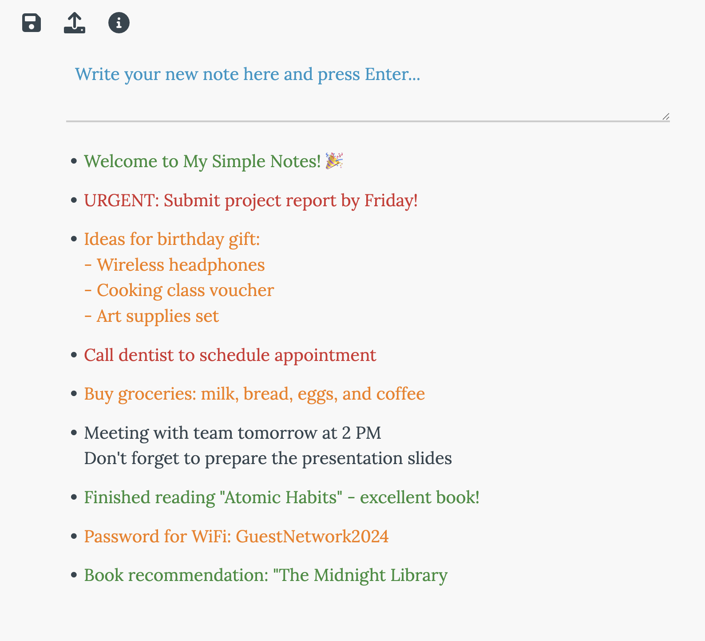

# My Simple Notes

A simple, elegant, and feature-rich note-taking application built with HTML, CSS, and vanilla JavaScript. Perfect for quick thoughts, to-do lists, and organizing your ideas.

 <!-- Add a screenshot of your app here -->

## ✨ Features

### 📝 Note Management
- **Quick Note Creation**: Write your thoughts in the input field and press `Enter` to create a new note
- **Easy Editing**: Double-click any note to edit it inline with a comfortable textarea
- **One-Click Color Coding**: Single-click notes to cycle through colors (red, orange, green, default)
- **Simple Deletion**: Right-click any note to delete it (with confirmation dialog)

### 🎨 Visual Design
- **Beautiful Typography**: Uses the elegant Lora serif font from Google Fonts
- **Clean Interface**: Minimalist design with a soft off-white background
- **Bullet Points**: Automatic bullet points for better visual organization
- **Smooth Animations**: Hover effects and transitions for a polished experience

### 🔄 Organization
- **Drag & Drop Reordering**: Click and drag notes to rearrange them in your preferred order
- **Visual Drop Indicators**: Blue preview line shows exactly where your note will be placed
- **Automatic Saving**: All changes are instantly saved to your browser's local storage

### 💾 Data Management
- **JSON Export**: Save all your notes to a `.json` file for backup or sharing
- **JSON Import**: Restore notes from a previously saved `.json` file
- **Local Storage**: Notes persist between browser sessions automatically
- **Cross-Session Compatibility**: Import/export works across different devices and browsers

### 🎯 User Experience
- **Keyboard Shortcuts**: 
  - `Enter` to create new notes
  - `Shift + Enter` for multi-line notes
  - `Enter` to save when editing
  - Click outside to save edits
- **Context Menu**: Right-click for quick actions
- **Responsive Design**: Works on desktop and mobile devices
- **Help Modal**: Built-in instructions accessible via the info icon

## 🚀 Getting Started

### Installation
1. Clone this repository or download the `note.html` file
2. Open `note.html` in your web browser
3. Start taking notes immediately!

### No Dependencies Required
This application runs entirely in your browser with no external dependencies beyond:
- Google Fonts (Lora)
- Font Awesome icons (for UI controls)

## 📖 How to Use

### Creating Notes
1. Type your note in the text area at the bottom
2. Press `Enter` to create the note
3. Use `Shift + Enter` for multi-line notes

### Editing Notes
- **Double-click** any existing note to edit it
- Press `Enter` or click outside the note to save changes

### Color Coding
- **Single-click** a note to cycle through colors:
  - Default (dark gray)
  - Red (for urgent items)
  - Orange (for warnings or medium priority)
  - Green (for completed or positive items)

### Organizing Notes
- **Click and drag** any note to reorder your list
- A blue preview line shows where the note will be placed
- Release to confirm the new position

### Deleting Notes
- **Right-click** any note you want to remove
- Confirm deletion in the popup dialog

### Backup and Restore
- **Save Icon** (💾): Download all notes as a JSON file
- **Upload Icon** (📤): Import notes from a JSON file
- **Info Icon** (ℹ️): View usage instructions

## 🛠️ Technical Details

### Technologies Used
- **HTML5**: Semantic markup and structure
- **CSS3**: Modern styling with animations and responsive design
- **Vanilla JavaScript**: No frameworks - pure JavaScript for maximum compatibility
- **Local Storage API**: Browser-based persistence
- **File API**: JSON import/export functionality

### Browser Compatibility
- Modern browsers (Chrome, Firefox, Safari, Edge)
- Mobile browsers (iOS Safari, Chrome Mobile)
- Requires JavaScript enabled
- Requires Local Storage support

### File Structure
```
my-simple-notes/
├── note.html          # Single-file application
├── README.md           # This documentation
└── screenshot.png      # App screenshot (optional)
```

## 🎨 Customization

The application uses CSS custom properties and is easy to customize:

### Colors
- Primary text: `#36454F` (charcoal gray)
- Background: `#F8F8F8` (off-white)
- Accent: `#1e97c7` (blue)
- Note colors: Red (`#D32F2F`), Orange (`#F57C00`), Green (`#388E3C`)

### Typography
- Font family: 'Lora' serif from Google Fonts
- Base font size: 1.2em for comfortable reading

## 🔒 Privacy & Data

- **Local Storage Only**: All data stays on your device
- **No Server Required**: Completely client-side application
- **Export Control**: You control your data with JSON export/import
- **No Tracking**: No analytics or external tracking

## 🤝 Contributing

This is a single-file application perfect for:
- Learning vanilla JavaScript
- Understanding DOM manipulation
- Practicing CSS animations
- Exploring Local Storage API

Feel free to fork, modify, and submit improvements!

## 📝 License

This project is open source and available under the [MIT License](LICENSE).

## 🆘 Support

If you encounter any issues or have suggestions:
1. Check the built-in help (click the ℹ️ icon)
2. Ensure JavaScript is enabled in your browser
3. Verify Local Storage is available (not in private/incognito mode)
4. Try refreshing the page

**Enjoy organizing your thoughts with My Simple Notes!** 📝✨
